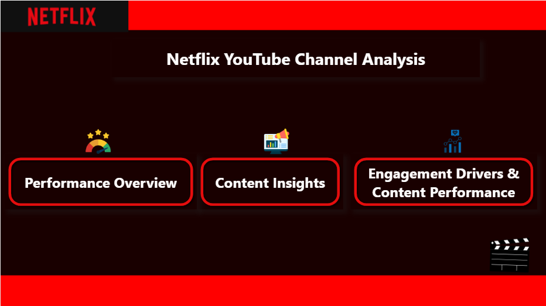
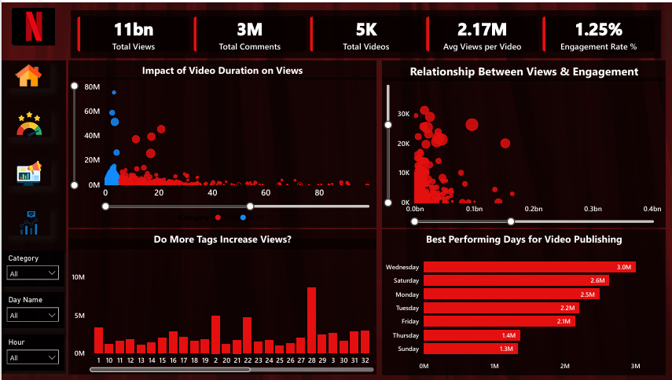
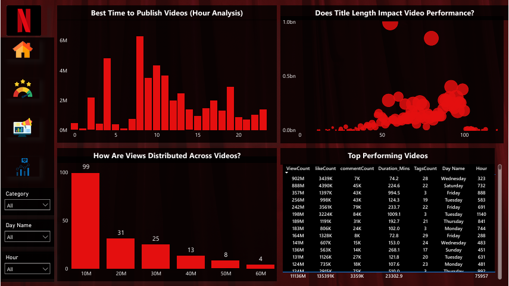
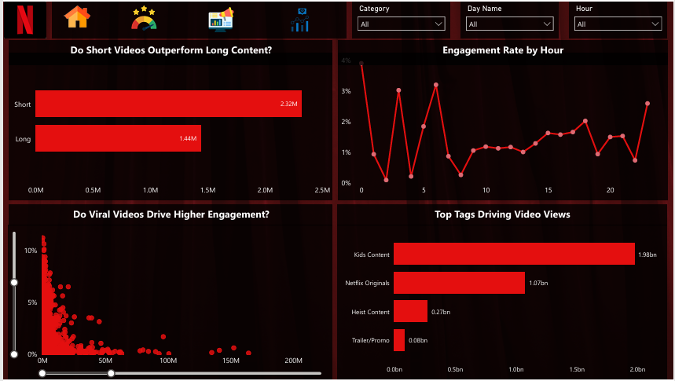

##  📊 Netflix YouTube Channel Analysis (Power BI)
## 🚀 Project Overview

This project analyzes Netflix India’s YouTube channel to uncover insights about content performance, audience engagement, and publishing strategy.

## The goal is to identify:

- What type of content performs best
- When to post videos
- What drives higher engagement
  
## 🎯 Key Insights
📌 Short videos tend to perform better than long videos

📌 Engagement varies significantly by publishing hour

📌 Certain categories like Kids Content & Trailers drive high views

📌 Tags and keywords play a role, but content type matters more

📌 A few viral videos heavily influence total views

## 🛠️ Tools Used
- Power BI
- Power Query
- DAX (Basic Measures)
  
## 📂 Dataset
- Source: Netflix India YouTube Data
Includes:
- Views, Likes, Comments
- Tags, Title, Description
- Publish Date & Time
- Duration

## ⚙️ Data Processing
- Converted ISO duration to minutes
Created:
- Duration Category (Short/Long)
- Tags Count
- Publish Day & Hour
- Title Length
Handled skewed data using bins

## 📊 Dashboard Pages

### 🏠 Home
Navigation page for all dashboards

### 📈 Performance Overview
- Total Views, Likes, Videos  
- Duration vs Views  
- Views vs Engagement  
- Best Publishing Days  

### 📊 Content & Strategy Insights
- Best time to post (hour analysis)  
- Title length vs views  
- Views distribution  
- Top performing videos  

### 📉 Engagement Analysis
- Engagement rate by hour  
- Content category performance  
- Tags driving views  

## 📸 Dashboard Preview

### 🏠 Home

### 📈 Performance Overview

### 📊 Content & Strategy Insights

### 📉 Engagement Analysis

## 💡 Business Recommendations
- Focus on short-form content
- Post during high engagement hours
- Use strong and relevant keywords
- Invest more in high-performing categories
- Optimize titles for better reach
  
## ⭐ What I Learned
- Handling skewed real-world data
- Building interactive dashboards
- Translating data into business insights
- Importance of storytelling in analytics
  
## 🔗 Connect With Me

- 💼 LinkedIn: https://www.linkedin.com/in/YOUR-LINK
